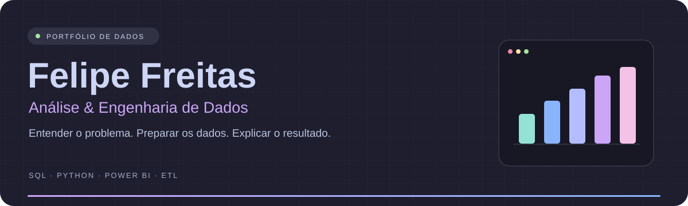

  

  <a href="#sobre-mim">Sobre mim</a> ·
  <a href="#projetos">Projetos</a> ·
  <a href="#ferramentas">Ferramentas</a> ·
  <a href="#estudos">Estudos</a> ·
  <a href="#atividade">Atividade</a>

Sobre mim
Sou Felipe dos Santos de Freitas, estudante de Ciência de Dados na UNINTER. Meu interesse está em entender como os dados representam um negócio: o que explica uma variação nas vendas, como calcular um indicador e quais verificações tornam uma análise confiável.
Construo meu portfólio com projetos de análise exploratória e ETL, usando SQL e Python para organizar, transformar e investigar dados. Quero atuar em Análise de Dados e aprofundar minha formação em Engenharia de Dados, conectando a preparação das bases ao uso das informações.
Atualmente, trabalho como Analista de Implantação na Telematica, com configuração e validação de sistemas. Essa experiência acompanha meu desenvolvimento em dados e reforça a importância de compreender requisitos e conferir resultados.
Meu foco é entender de onde o dado vem, como ele foi tratado e o que o resultado permite concluir.

Projetos em destaque

Pergunta central: como preparar dados de vendas para comparar o desempenho dos produtos?
Estudo de extração, transformação e carga com a base AdventureWorks 2022. O projeto relaciona pedidos, itens e produtos, delimita um período de análise e consolida as vendas por produto.
Prática: junções de tabelas, agregações, cálculo de métricas e classificação por percentis de vendas.
Explorar o projeto →

Pergunta central: como o faturamento se distribui entre produtos, regiões e períodos?
Análise exploratória de uma base fictícia de vendas, gerada para estudo. O notebook prepara datas, calcula faturamento e compara os resultados por mês, estado, categoria e produto.
Prática: tratamento de dados, agrupamentos e visualizações com Matplotlib e Seaborn.
Explorar o notebook →

  <a href="https://github.com/FSFbot?tab=repositories">Ver todos os repositórios →</a>

Ferramentas que uso nos estudos e projetos

  
  
  
  
  
  
  

Área	Aplicação
Consulta e exploração	SQL para relacionar tabelas, filtrar registros e calcular indicadores.
Preparação de dados	Python, Pandas e NumPy para limpeza, transformação e agregação.
Análise e visualização	Notebooks, Matplotlib, Seaborn e prática com Power BI.
Bases relacionais	SQL Server para consultas e estudos com dados estruturados.

O que estou aprofundando
- Ciência de Dados: tecnólogo na UNINTER, com conclusão prevista para 2028.
- SQL e Python: transformar perguntas de negócio em consultas e análises verificáveis.
- Qualidade dos dados: conferir duplicidades, valores ausentes e consistência dos indicadores.
- ETL e Engenharia de Dados: organizar transformações e consolidar a base para estudar orquestração com Apache Airflow.
- Projetos de estudo: reconstrução guiada de um projeto do Téo Me Why.

Cada contribuição, um pouco mais de prática

  

<!-- A animação aparece após a primeira execução bem-sucedida do workflow snake.yml. -->

Vamos conversar
Gosto de trocar ideias sobre análise de dados, SQL, visualização e Engenharia de Dados. Os repositórios deste perfil registram o que estou aprendendo e colocando em prática.
 

  Paleta <a href="https://github.com/catppuccin/catppuccin">Catppuccin Mocha</a> · Referência de estrutura: <a href="https://github.com/iuricode/readme-template/blob/main/perfil/exemplo-06.md">Iuri Silva</a> · Snake: <a href="https://github.com/Platane/snk">Platane/snk</a>

